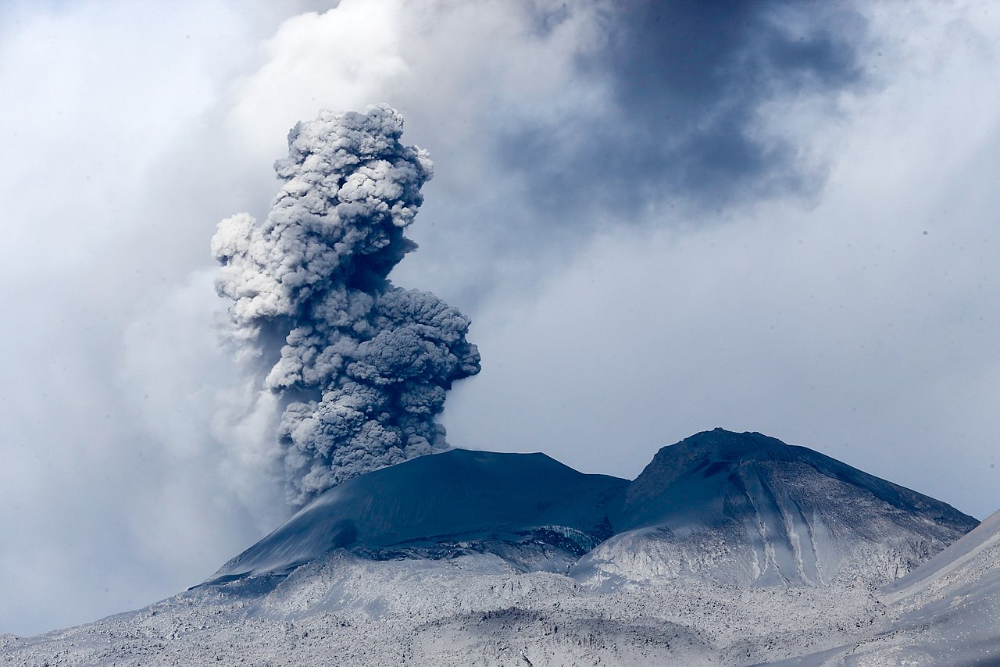

## Load Packages and Data

```{r load-packages, message = FALSE}
library(tidyverse)
library(broom)
library(janitor)
library(glue)
library(choroplethr)
library(choroplethrMaps)
```

```{r read-in-data, message=FALSE}
volcano <- read_csv("../data/volcano.csv")
eruptions <- read_csv("../data/eruptions.csv")
events <- read_csv("../data/events.csv")

```

## Introduction




**Research Question: What factors could affect the frequency of volcano eruptions?**

As a team we choose to use the Volcano Eruptions data set from the tidytuesday package for our data due to the interesting nature of the data, the number of observations, and the variety and number of variables. We have decided our research will focus on the factors that could influence the frequency of volcano eruptions.

The data in the Volcano eruption dataset comes from the Smithsonian Institution's Global Volcanism Program (GVP), which reports on the world's volcanos, and their eruptions, both current and dating back to 10,000 years ago. The data was collected from the Volcanos of the World database which is maintained by the GVP. The GVP's aim is to "document, understand, and disseminate information about global volcanic activity," as their website https://volcano.si.edu/ states.
Each observation in the dataset volcano contains information on one of the earth's volcanoes, information such as the type of the volcano, where it is located and the types of rocks that make up te volcano. In the eruptions dataset each observation documents an eruption of one of the earth's volcano, documenting where and when each eruption occurs, as well as the eruption type and category.
At present we are unsure exactly how the data was collected as the sources don't specify but we will continue to research how it might have been collected as we progress.

## Data Sets


```{r glimpse-data}

glimpse(volcano)
glimpse(eruptions)
glimpse(events)

```

In order to create the visualization, we need to reformat the data:

```{r data-for-map}
#Join eruptions and volcano to match each eruption to its corresponding volcano
volcanic_eruption <- left_join(volcano, eruptions, by="volcano_number")
#load df with list of countries
data("country.regions")
#create CountVolc which stores number of eruptions for each country
CountVolc = group_by(volcanic_eruption, country) %>% summarise(value = n())
CountVolc = as.data.frame(CountVolc)
CountVolc[,1] = tolower(CountVolc[,1])
rownames(CountVolc) = CountVolc$country

#some eruptions are on the border between two countries, so we split that count between each country
CountVolc["chile","value"] = CountVolc["chile","value"] + CountVolc["chile-argentina","value"]/2
CountVolc["argentina","value"] = CountVolc["argentina","value"] + CountVolc["chile-argentina","value"]/2

#some country names must be changed to get the count
CountVolc$country=gsub("united states", "united states of america", CountVolc$country)

#Aggregating the counts into unique country names
CountVolcUni <- group_by(CountVolc, country) %>%
  summarise(value = sum(value))
CountVolcUni = as.data.frame(CountVolcUni)
rownames(CountVolcUni) = CountVolcUni$country
```


## 3. Data analysis plan

```{r World-Map}
#create tibble with rownames as countries
CountVolcFake = country.regions
CountVolcFake$value = 0
rownames(CountVolcFake) = CountVolcFake$region
#choose the countries in both tibbles
ii=intersect(CountVolcUni$country,country.regions$region)
CountVolcFake[ii, "value"] = (CountVolcUni[ii, "value"])
#create choropleth map with palette
country_choropleth(CountVolcFake, num_colors = 9) +
scale_fill_brewer(palette="YlOrRd") +
labs(title = "Number of Volcanic Eruptions by Country")


#find countries that arent included
MissingCountries = CountVolcUni$country[!CountVolcUni$country %in% country.regions$region]
```


```{r mean-count}
CountVolc %>%
  summarise(mean_active_countries = mean(value), sd_active_countries = sd(value))
```

We have chosen a very general research question to begin with, so we can decide the specifics of the project later. We want to explore what affects volcanic eruptions, including location (country), tectonic setting... etc. An example of what we might explore is eruption count by country, which can be seen in the map above. This visualization is more complicated than the ones we covered in class, but we think it is much easier to see which countries have had the most eruptions. Of course, this is just a start, and we will approach our question in other ways later. We will have multiple explanatory variables in our analysis on the factors that affect the frequency of eruptions (the response variable), so we can spot trends by location for example. As we can see, Japan, the United States, and Russia have had the most eruptions. We plan on further exploring the effect of location on eruptions, for example, by plotting each eruption as a point on a map, and projecting those points onto a tectonic plate map. We could also explore the distribution of eruption counts, with histograms, finding the mean and sd for each hemisphere and comparing the two...etc (there are many trends we can find in this data set). Just by looking at the mean and sd of active countries, we can already see how right skewed the distribution will be. 
The preliminary map will of course be altered and improved in the future, for example we might use a sqrt scale, or focus on certain regions more than others.
