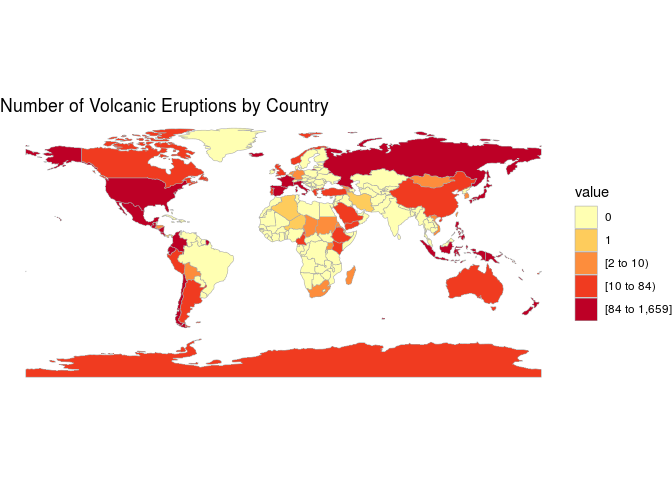

Project proposal
================
x404-pagenotfound

``` r
library(tidyverse)
library(broom)
library(janitor)
library(glue)
library(choroplethr)
library(choroplethrMaps)
```

``` r
volcano <- read_csv("../data/volcano.csv")
eruptions <- read_csv("../data/eruptions.csv")
events <- read_csv("../data/events.csv")
```


## 1\. Introduction

## What factors affect the volcanic eruptions?

As a team we choose to use the Volcano Eruptions data set from the
tidytuesday package for our package, due to the interesting nature of
the data, the number of observations, and the variety and number of
variables. We have decided our research will focus on the factors that
could influence the length of volcano eruptions.

The data in the Volcano eruption dataset comes from the Smithsonian
Institution’s Global Volcanism Program (GVP), which reports on the
world’s volcanos, and their eruptions, both current and dating back to
10,000 years ago. The data was collected from the Volcanos of the World
database which is maintained by the GVP. The GVP’s aim is to “document,
understand, and disseminate information about global volcanic activity,”
as their website <https://volcano.si.edu/> states. Each observation in
the dataset volcano contains information on one of the earth’s
volcanoes, information such as the type of the volcano, where it is
located and the types of rocks that make up te volcano. In the eruptions
dataset each observation documents an eruption of one of the earth’s
volcano, documenting where and when each eruption occurs, as well as the
eruption type and category. At present we are unsure exactly how the
data was collected as the sources don’t specify but we will continue to
research how it might have been collected as we progress. \#\# 2. Data

``` r
glimpse(volcano)
```

    ## Rows: 958
    ## Columns: 26
    ## $ volcano_number           <dbl> 283001, 355096, 342080, 213004, 321040, 2831…
    ## $ volcano_name             <chr> "Abu", "Acamarachi", "Acatenango", "Acigol-N…
    ## $ primary_volcano_type     <chr> "Shield(s)", "Stratovolcano", "Stratovolcano…
    ## $ last_eruption_year       <chr> "-6850", "Unknown", "1972", "-2080", "950", …
    ## $ country                  <chr> "Japan", "Chile", "Guatemala", "Turkey", "Un…
    ## $ region                   <chr> "Japan, Taiwan, Marianas", "South America", …
    ## $ subregion                <chr> "Honshu", "Northern Chile, Bolivia and Argen…
    ## $ latitude                 <dbl> 34.500, -23.292, 14.501, 38.537, 46.206, 37.…
    ## $ longitude                <dbl> 131.600, -67.618, -90.876, 34.621, -121.490,…
    ## $ elevation                <dbl> 641, 6023, 3976, 1683, 3742, 1728, 1733, 125…
    ## $ tectonic_settings        <chr> "Subduction zone / Continental crust (>25 km…
    ## $ evidence_category        <chr> "Eruption Dated", "Evidence Credible", "Erup…
    ## $ major_rock_1             <chr> "Andesite / Basaltic Andesite", "Dacite", "A…
    ## $ major_rock_2             <chr> "Basalt / Picro-Basalt", "Andesite / Basalti…
    ## $ major_rock_3             <chr> "Dacite", " ", " ", "Basalt / Picro-Basalt",…
    ## $ major_rock_4             <chr> " ", " ", " ", "Andesite / Basaltic Andesite…
    ## $ major_rock_5             <chr> " ", " ", " ", " ", " ", " ", " ", " ", " ",…
    ## $ minor_rock_1             <chr> " ", " ", "Basalt / Picro-Basalt", " ", "Dac…
    ## $ minor_rock_2             <chr> " ", " ", " ", " ", " ", "Basalt / Picro-Bas…
    ## $ minor_rock_3             <chr> " ", " ", " ", " ", " ", " ", " ", "Andesite…
    ## $ minor_rock_4             <chr> " ", " ", " ", " ", " ", " ", " ", " ", " ",…
    ## $ minor_rock_5             <chr> " ", " ", " ", " ", " ", " ", " ", " ", " ",…
    ## $ population_within_5_km   <dbl> 3597, 0, 4329, 127863, 0, 428, 101, 51, 0, 9…
    ## $ population_within_10_km  <dbl> 9594, 7, 60730, 127863, 70, 3936, 485, 6042,…
    ## $ population_within_30_km  <dbl> 117805, 294, 1042836, 218469, 4019, 717078, …
    ## $ population_within_100_km <dbl> 4071152, 9092, 7634778, 2253483, 393303, 502…

``` r
glimpse(eruptions)
```

    ## Rows: 11,178
    ## Columns: 15
    ## $ volcano_number         <dbl> 266030, 343100, 233020, 345020, 353010, 273070…
    ## $ volcano_name           <chr> "Soputan", "San Miguel", "Fournaise, Piton de …
    ## $ eruption_number        <dbl> 22354, 22355, 22343, 22346, 22347, 22344, 2234…
    ## $ eruption_category      <chr> "Confirmed Eruption", "Confirmed Eruption", "C…
    ## $ area_of_activity       <chr> NA, NA, NA, NA, NA, NA, NA, "1978/90 Crater Co…
    ## $ vei                    <dbl> NA, NA, NA, NA, NA, NA, NA, 2, NA, 1, NA, NA, …
    ## $ start_year             <dbl> 2020, 2020, 2020, 2020, 2020, 2020, 2020, 2019…
    ## $ start_month            <dbl> 3, 2, 2, 1, 1, 1, 1, 12, 12, 12, 11, 11, 10, 1…
    ## $ start_day              <dbl> 23, 22, 10, 31, 12, 12, 11, 9, 7, 5, 7, 2, 24,…
    ## $ evidence_method_dating <chr> "Historical Observations", "Historical Observa…
    ## $ end_year               <dbl> 2020, 2020, 2020, 2020, 2020, 2020, 2020, 2019…
    ## $ end_month              <dbl> 4, 2, 4, 4, 1, 1, 4, 12, 3, 4, 12, 4, 4, 10, 8…
    ## $ end_day                <dbl> 2, 22, 6, 17, 12, 22, 17, 9, 15, 17, 7, 16, 17…
    ## $ latitude               <dbl> 1.112, 13.434, -21.244, 10.830, -0.370, 14.002…
    ## $ longitude              <dbl> 124.737, -88.269, 55.708, -85.324, -91.550, 12…

``` r
glimpse(events)
```

    ## Rows: 41,322
    ## Columns: 10
    ## $ volcano_number      <dbl> 210020, 210020, 210020, 210020, 210020, 210020, 2…
    ## $ volcano_name        <chr> "Chaine des Puys", "Chaine des Puys", "Chaine des…
    ## $ eruption_number     <dbl> 10011, 10011, 10011, 10011, 10011, 10011, 10012, …
    ## $ eruption_start_year <dbl> -4040, -4040, -4040, -4040, -4040, -4040, -3600, …
    ## $ event_number        <dbl> 100001, 100002, 100003, 100004, 100005, 100006, 1…
    ## $ event_type          <chr> "Explosion", "Scoria", "Pyroclastic flow", "Lava …
    ## $ event_remarks       <chr> NA, NA, NA, NA, NA, NA, NA, NA, NA, "Uncertain", …
    ## $ event_date_year     <dbl> NA, NA, NA, NA, NA, NA, NA, NA, NA, NA, NA, NA, N…
    ## $ event_date_month    <dbl> NA, NA, NA, NA, NA, NA, NA, NA, NA, NA, NA, NA, N…
    ## $ event_date_day      <dbl> NA, NA, NA, NA, NA, NA, NA, NA, NA, NA, NA, NA, N…

In order to create the visualization, we need to reformat the data:

``` r
#Join eruptions and volcano to match each eruption to its corresponding volcano
volcanic_eruption <- left_join(volcano, eruptions, by="volcano_number")
#load df with list of countries
data("country.regions")
#create CountVolc which stores number of eruptions for each country
CountVolc = group_by(volcanic_eruption, country) %>% summarise(value = n())
```

    ## `summarise()` ungrouping output (override with `.groups` argument)

``` r
CountVolc = as.data.frame(CountVolc)
CountVolc[,1] = tolower(CountVolc[,1])
rownames(CountVolc) = CountVolc$country

#some eruptions are on the border between two countries, so we split that count between each country
CountVolc["chile","value"] = CountVolc["chile","value"] + CountVolc["chile-argentina","value"]/2
CountVolc["argentina","value"] = CountVolc["argentina","value"] + CountVolc["chile-argentina","value"]/2

#some country names must be changed to get the count
CountVolc$country=gsub("united states", "united states of america", CountVolc$country)

#Aggregating the counts into unique country names
CountVolcUni <- group_by(CountVolc, country) %>%
  summarise(value = sum(value))
```

    ## `summarise()` ungrouping output (override with `.groups` argument)

``` r
CountVolcUni = as.data.frame(CountVolcUni)
rownames(CountVolcUni) = CountVolcUni$country
```

## 3\. Data analysis plan

``` r
#create tibble with rownames as countries
CountVolcFake = country.regions
CountVolcFake$value = 0
rownames(CountVolcFake) = CountVolcFake$region
#choose the countries in both tibbles
ii=intersect(CountVolcUni$country,country.regions$region)
CountVolcFake[ii, "value"] = (CountVolcUni[ii, "value"])
#create choropleth map with palette
country_choropleth(CountVolcFake, num_colors = 9) +
scale_fill_brewer(palette="YlOrRd") +
labs(title = "Number of Volcanic Eruptions by Country")
```

    ## Scale for 'fill' is already present. Adding another scale for 'fill', which
    ## will replace the existing scale.

<!-- -->

``` r
#find countries that arent included
MissingCountries = CountVolcUni$country[!CountVolcUni$country %in% country.regions$region]
```

We have chosen a very general research question to begin with, so we can
decide the specifics of the project later. We want to explore what
affects volcanic eruptions, including location (country), tectonic
setting… etc. An example of what we might explore is eruption count by
country, which can be seen in the map above. This visualization is more
complicated than the ones we covered in class, but we think it is much
easier to see which countries have had the most eruptions. Of course,
this is just a start, and we will approach our question in other ways
later. We will have multiple explanatory variables in our analysis on
the factors that affect the frequency of eruptions (the response
variable), so we can spot trends by location for example. As we can see,
Japan, the United States, and Russia have had the most eruptions. We
plan on further exploring the effect of location on eruptions, by
plotting each eruption as a point on a map, and projecting those points
onto a tectonic plate map. We could also explore the distribution of
eruption counts, finding the mean and Sd for each hemisphere and
comparing the two…etc (there are many trends we can find in this data
set). This preliminary map will of course be altered and improved in the
future, for example we might make the scale sqrt, or focus on certain
regions more than others.
